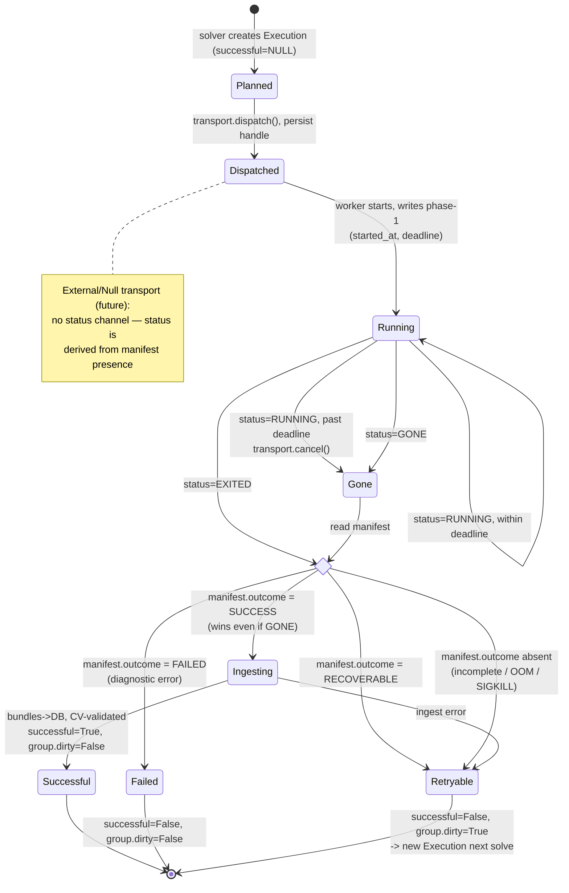

- Feature Name: `execution_lifecycle`
- Start Date: 2026-05-12
- RFC PR: [Climate-REF/rfcs#3](https://github.com/Climate-REF/rfcs/pull/3)

# Summary

Replace the shallow `Executor` protocol and its three divergent implementations
(`SynchronousExecutor`, `LocalExecutor`, `CeleryExecutor`)
with one execution lifecycle built on two ideas.

1. A self-describing, on-disk **execution manifest** (`execution.json`) that records what an execution *is* and how it *ended*.
2. A thin **`Transport`** port that only *launches* work and reports *liveness*
   (`RUNNING | EXITED | GONE`).

Results never travel back through the transport.
Every execution method — in-process, process pool, Celery, SLURM, PBS —
completes by writing its CMEC bundles to a directory on disk,
and a single, transport-agnostic *ingest* step loads the manifest and bundles into the database.

This makes executions crash-robust and replayable,
makes diagnostic output self-describing so it can be compared across runs and versions (regression),
and reduces every backend to a launcher plus a status query.

# Motivation

The REF needs **one robust way to run diagnostics** that works across a range of deployments -
a laptop, a Celery cluster, and an HPC batch scheduler at a modelling centre.
"Robust" has a concrete meaning here: an execution survives coordinator and worker crashes cleanly,
and an operator can always see *what a run did and why it failed* from durable state, not from a live process.

Today none of that holds, for four reasons.

## The lifecycle is fragmented across divergent executors

A single happy-path run touches eight files in two packages:

- `solver.py` allocates the row and fragment,
  registers datasets, expunges, and commits before handing off to an executor.
- `climate_ref_core/executor.py` holds `execute_locally`, `_is_system_error`,
  and the `CondaCommandError` branch.
- `climate_ref_core/diagnostics.py` holds `ExecutionResult.build_from_output_bundle`,
  a static factory that writes three JSON files to disk as a side effect of constructing the result.
- `climate_ref/executor/result_handling.py` copies scratch->results, ingests inside a nested transaction,
  and toggles the `dirty` flag in three branches.
- One of `synchronous.py` / `local.py` / `climate_ref_celery/executor.py`
  re-implements the reattach / commit / mark dance.

The three executors diverge in ways that matter:
`LocalExecutor` applies a single 6-hour per-task timeout to every diagnostic;
`CeleryExecutor` enforces no per-task timeout at all;
`SynchronousExecutor` runs inline.
Retry classification is scattered across `_is_system_error`, the `CondaCommandError` branch,
missing-log handling, the per-task timeout path, and pool-shutdown abandonment.

## Executions are not robust to crashes

Failure state is decided from a *live* exception in `execute_locally` and recorded only in the database.
If a worker is OOM-killed, the coordinator dies mid-drain, or a Celery broker is lost,
there is no durable record on disk of what the execution was or how far it got.
The `LocalExecutor` join loop marks abandoned futures retryable from memory;
once that process is gone, the knowledge is gone.
An operator inspecting a stuck `Execution` row (`successful IS NULL`)
cannot tell whether it is still running or died hours ago.

## Results are not self-describing

An execution directory today contains the CMEC output bundle (`output.json`),
the CMEC diagnostic bundle (`diagnostic.json`), the series values (`series.json`), and a log (`out.log`).
**Nothing on disk says which diagnostic, provider version, or datasets produced them** —
that identity lives only in the database, and `reingest` rebuilds it *from* the database.
This blocks the primary motivation for this RFC: **regression output**.
To compare a diagnostic's output across versions or runs,
or to re-ingest results after changing extraction logic,
the result directory must carry its own identity and outcome.
It also blocks any future where a directory is copied between deployments.

## There is no seam for HPC

Modelling centres often use SLURM and PBS for task scheduling.
There is nowhere for a diagnostic to declare it needs 16 GB or 8 hours,
and nothing a batch adapter could translate into `sbatch --mem --time` or `qsub -l`.

# Reference-level explanation

## Two verbs: `run` and `ingest`

The lifecycle splits cleanly into two operations that today are tangled together.

- **`run`**: turn an `ExecutionDefinition` into an output directory on disk —
  a manifest plus CMEC bundles. A `Transport` drives this (or, in future, an external system does).
- **`ingest`**: load one output directory into the database. Transport-agnostic, idempotent, replayable.

Every execution method funnels through the same `ingest`.
Live completion, re-ingestion after a logic change, and (future) cross-deployment import
are the *same code path* reading the *same on-disk format*.

The concept of `ingest` isn't new in the REF.
Datasets are currently ingested to extract information from the dataset and put it in the database.

## The execution manifest (`execution.json`)

A REF-owned, typed, versioned file written to the execution directory.
It is the durable record of an execution's identity and outcome.
CMEC provides building blocks for *provenance* but has no vocabulary for *outcome*,
so the manifest is a REF schema that embeds CMEC provenance rather than living inside the CMEC output bundle.

```python
class ManifestStatus(enum.Enum):
    SUCCESS     = "success"      # ran; produced a valid, CV-checkable bundle
    FAILED      = "failed"       # ran; diagnostic logic error — not retryable (give up)
    RECOVERABLE = "recoverable"  # ran; system/transient error — retryable

@attrs.frozen
class DatasetRef:
    instance_id: str             # Dataset.slug — the CMIP6 instance_id; assumed globally unique
    slug_column: str
    source_type: str             # SourceDatasetType: cmip6, obs4mips, ...

@attrs.frozen
class Outcome:                   # phase 2 — written when the diagnostic ends
    status: ManifestStatus
    exit_code: int | None
    finished_at: datetime
    output_bundle: str | None    # output.json     — CMEC output bundle (CMECOutput)
    metric_bundle: str | None    # diagnostic.json  — CMEC diagnostic bundle (CMECMetric)
    series: str | None           # series.json
    log: str = "out.log"
    provenance: OutputProvenance | None = None   # CMEC environment / modeldata / obsdata / log

@attrs.frozen
class ExecutionManifest:
    schema_version: int
    # --- identity: phase 1, written when the run starts ---
    diagnostic_slug: str
    diagnostic_version: int
    provider_slug: str
    provider_version: str
    dataset_hash: str
    datasets: list[DatasetRef]
    selectors: dict[str, str]
    started_at: datetime             # when the worker began running the diagnostic
    deadline: datetime               # drop-dead: complete-by = started_at + resources.wall_clock
    # --- outcome: phase 2 ---
    outcome: Outcome | None = None   # None ⇒ incomplete (in-flight, or hard-killed before writing)
```

**Two-phase write.**
The identity half is the *first* file written to the directory, the moment the worker starts —
before the diagnostic runs, with `outcome = None`.
It stamps `started_at` and `deadline` (the drop-dead time, `started_at + wall_clock`),
so the file itself declares when the execution must be complete by.
The outcome half is the *last* thing the worker writes, **even on a recoverable failure**.
Therefore a manifest with `outcome is None` means *incomplete*:
either still in flight, or hard-killed (OOM, `SIGKILL`, node loss) before it could write its epitaph.
This single invariant is what makes crashes diagnosable from disk alone.

The outcome must be written **atomically** (write a temp file, `fsync`, then `rename`),
so a worker killed mid-write can never leave a half-written outcome that reads as present-but-corrupt.
A present outcome is therefore always complete, which is what lets a lost (`GONE`) job be trusted
exactly as much as a cleanly `EXITED` one.

**Drop-dead deadline.**
Because `deadline` is recorded on disk, an operator — or a reconciling coordinator with a weak transport —
can flag an overdue execution (`now > deadline` and `outcome is None`) without querying the scheduler.
It is anchored at `started_at`, never at submit time, so a job that waited hours in a SLURM queue
is judged from when it actually began.

**CMEC alignment.**
`provenance` reuses the CMEC `OutputProvenance` shape (`environment`, `modeldata`, `obsdata`, `log`),
so the manifest captures inputs and environment in standard terms.
`datasets` references inputs by `instance_id` (the CMEC/ESGF dataset identity),
which is what makes a directory portable: it names its inputs without carrying them.

## The `Transport` port

A transport launches an execution and answers one question: *is it alive?*
It never carries results as that greatly simplifies the required functionality.

```python
class Status(enum.Enum):
    RUNNING = "running"   # still executing
    EXITED  = "exited"    # ended with a clean exit code
    GONE    = "gone"      # vanished without a clean exit (OOM, SIGKILL, node loss, timeout-kill)

class Transport(Protocol):
    name: ClassVar[str]
    def dispatch(self, envelope: ExecutionEnvelope) -> str: ...        # launch; return durable handle
    def status(self, handles: Mapping[int, str]) -> Mapping[int, Status]: ...
    def cancel(self, handle: str) -> None: ...                         # deadline / drain kill
    def shutdown(self, timeout: float) -> None: ...
```

`dispatch` returns a durable handle (pid, Celery task id, SLURM job id)
that the lifecycle persists on the `Execution` row in the same commit,
so a freshly restarted coordinator can still ask about the job that may be in flight.

```python
@attrs.frozen
class ResourceHint:
    memory_mb: int = 4096
    cpu: int = 1
    wall_clock: timedelta = timedelta(hours=6)   # matches today's LocalExecutor budget
    queue: str | None = None                     # transport-specific routing tag

@attrs.frozen
class ExecutionEnvelope:
    execution_id: int
    definition: ExecutionDefinition
    resources: ResourceHint
    # wall_clock travels inside `resources`; the worker stamps the absolute deadline into the
    # manifest at job *start* (started_at + wall_clock), never at submit — a queued SLURM/PBS
    # job may wait hours before it begins.
```

The default `wall_clock` is 6 h to match today's `LocalExecutor` budget,
so diagnostics that run for hours without declaring `resources` keep their current allowance.

## The lifecycle and the drain loop

`ExecutionLifecycle` owns the submission of new executions, the drain loop, retry/dirty, and ingest.
It is stateless with respect to in-flight work:
the set of executions to wait on comes from the database (`successful IS NULL`), not from memory.
This is what makes it re-runnable and crash-safe. Running `drain` after a restart simply resumes.

```python
for group, datasets, definition in planned_executions:
    execution = Execution(
        execution_group=group, 
        dataset_hash=datasets.hash,
        provider_version=definition.diagnostic.provider.version
    )
    # dispatch(), persist handle in db, worker writes phase-1 at start of execution
    lifecycle.submit(execution, definition)   

lifecycle.drain(timeout=timeout)
```

`drain` loops over the in-flight executions as queried from the database.
The transport decides liveness of the exeuction and the manifest determines the outcome.
If a outcome is present in a manifest, it wins over the liveness check.

```python
for ex in db.in_flight(submitted):                  # successful IS NULL
    match transport.status({ex.id: ex.handle})[ex.id]:
        case Status.RUNNING:
            if now > read_manifest(ex.dir).deadline:   # deadline check
                transport.cancel(ex.handle)            # ProcessPool only, other schedulers use native deadlines
            # else: keep waiting

        case Status.EXITED | Status.GONE as st:      # done - the manifest, not the transport, decides
            if st is Status.GONE:                    # transport lost the job; the manifest still rules
                logger.warning(f"{ex} vanished without a clean exit; trusting the on-disk manifest")
            outcome = read_manifest(ex.dir).outcome
            if outcome is None:                      # clean exit w/o epitaph, or hard crash (OOM / SIGKILL)
                mark_retryable(ex)
            elif outcome.status is SUCCESS:
                ingest_from_disk(ex.dir)             # CV-validated; same path for every transport
            elif outcome.status is FAILED:
                mark_failed(ex)                      # diagnostic error, give up
            else:                                    # RECOVERABLE
                mark_retryable(ex)
```

`EXITED` and `GONE` therefore take the *same* action — a present manifest outcome is applied either way,
and an absent one is retryable either way.
Transport status only separates `RUNNING` from done; the manifest decides the rest.
`GONE` differs only in that it emits a warning (the transport lost track of the job),
which matters for the case where the worker wrote `SUCCESS` and the node then died before being reaped:
the transport reports `GONE`, but the manifest still wins and the result is ingested.

## Execution states



A row has three terminal outcomes:
**Successful** (clean, group marked clean);
**Failed** (diagnostic error, not retryable, group marked clean);
**Retryable** (system/transient error or hard crash — the group stays dirty, and the next solve mints a *new*
`Execution`).
A retry never re-runs the same row.

## Execution Status

Classification of the status of an execution happens in two places.

**Worker side — exception -> outcome.**
The worker maps the raised exception (or a clean return) onto `ManifestStatus` and writes it to the manifest.
This is the one place that knows exception *types*, because the exception is only ever raised on the worker.
It consolidates the logic spread today across `_is_system_error` and the `CondaCommandError` branch:

```python
SYSTEM_ERRORS = (OSError, MemoryError, SystemExit, KeyboardInterrupt)  # -> RECOVERABLE
NON_RETRYABLE = (CondaCommandError,)                                   # -> FAILED
```

**Coordinator side — outcome -> decision.**
The drain loop maps the manifest outcome onto ingest / retry / give up:
`SUCCESS` -> ingest, `RECOVERABLE` -> retry, `FAILED` -> give up,
and a finished execution with no outcome -> retry.
It never inspects exception types, and it relies on transport liveness only to know the execution has
finished — not to classify it — so it behaves identically for every transport,
including remote ones where the exception object never comes back.

The `dirty` flag for an execution group is then updated:

- `SUCCESS` and `FAILED` clear the dirty state.
- `RECOVERABLE` and incomplete leave it set so the next solve retries the execution.

User-initiated `dirty = True` resets in `cli/executions.py` (rerun / reset) stay separate by design.

## Ingest from disk

`ingest_from_disk(directory)` reads `execution.json` and the bundles it names, then writes to the database.
It is the only path that mutates result tables, and it is:

- **Idempotent.** Inserts use `ON CONFLICT DO NOTHING` on natural keys
  (`(execution_id, output_type, short_name)` for outputs;
  `(execution_id, dimensions_hash[, index_name])` for diagnostic and series values).
  Each solve mints a new `execution_id` per attempt, so retries never collide;
  the conflict clause only guards re-ingestion of the *same* execution during a replay or eager/poll race.
- **CV-validated.** The CMEC diagnostic and series bundles are validated against the controlled vocabulary
  at ingest, exactly as today. Validations errors result in warnings rather than hard failures for now.
- **Portable.** Result directories hold results only, with relative internal paths.
  Inputs are referenced by `instance_id` and resolved against the importing deployment's dataset index;
  a directory never carries or hardcodes input data.

This is also what enables the existing `reingest` use case to work *without* the database it was produced from
(within limits — see portability tiers under Unresolved questions).

## Transports

All current executors are replaced, including the parsl-based HPC backend —
one transport covers both Slurm and PBS, selected by config, as `HPCExecutor` does today.
Each is a launcher plus a status query.

| Transport             | Replaces               | `dispatch`                        | `status` source     | deadline enforced by      |
|-----------------------|------------------------|-----------------------------------|---------------------|---------------------------|
| `InMemoryTransport`   | `SynchronousExecutor`  | run inline                        | always `EXITED`     | n/a (inline)              |
| `ProcessPoolTransport`| `LocalExecutor`        | `pool.submit`                     | `future` state      | coordinator (`cancel`)    |
| `CeleryTransport`     | `CeleryExecutor`       | `app.send_task`                   | `AsyncResult`       | broker (`task_time_limit`)|
| `HPCTransport`        | `HPCExecutor` (parsl)  | parsl provider submit (Slurm/PBS) | parsl future state  | block walltime + pilot    |

`ProcessPoolTransport` is the only transport that enforces the deadline coordinator-side
(via `cancel` -> `future.cancel`), because there is no external scheduler to do it;
this preserves today's `LocalExecutor` per-task timeout.

`HPCTransport` wraps parsl rather than calling `sbatch` / `qsub` directly.
parsl requests scheduler *blocks* (pilot jobs) and runs many executions inside each one,
so the scheduler walltime bounds the allocation, not the individual execution (to confirm);
per-execution `wall_clock` is enforced inside the pilot, as `HPCExecutor.join` does today.

**Celery callback.**
Today `CeleryExecutor` attaches `link` / `link_error` callbacks (`handle_result` / `handle_failure`)
that ingest worker-side.
In production, this requires an additional `orchastrator` worker.
Under this design the worker writes its bundle and manifest to disk like every other transport,
and the coordinator (or a resident orchestrator running `drain`) ingests from disk.
The `link` callback may be kept as an *eager-ingest hook* — "ingest this directory now" rather than at the next poll.
It's no longer load-bearing as if the callback is lost, the disk scan recovers the result.
This dissolves the previous push-vs-pull asymmetry and both modes run the same `ingest_from_disk`.

## Migration plan

The cutover replaces the seam the solver calls, so it lands in stages, each independently shippable:

1. **ExecutionManifest, additively.** Current executors start writing `execution.json` (both phases).
   No behaviour change; result directories become self-describing immediately — this alone unlocks regression comparison.
2. **New classes + local transports.** Introduce `ExecutionLifecycle`, the `Transport` port, `ingest_from_disk`,
   and `InMemoryTransport` + `ProcessPoolTransport`; route the solver through the lifecycle.
3. **Celery.** Port to `CeleryTransport`; convert `link`/`link_error` to the optional eager-ingest hook.
4. **HPC.** Port `HPCExecutor` to `HpcTransport` (Slurm + PBS via parsl).
5. **Cleanup.** Delete the `Executor` protocol and the three old executors once nothing imports them.

`import_executor_cls` (which resolves an executor from a dotted path in `Config`) gains a deprecation cycle:
known names map to the new transports, custom dotted paths warn, and a config-migration note ships with step 5.

# Drawbacks

- **The migration is wide.** The seam the solver calls is replaced, touching `climate-ref-core`,
  `climate-ref`, and `climate-ref-celery`. The staging above bounds the risk but does not remove it.
- **One deep module.** `ExecutionLifecycle` is intentionally a large, central class.
  Reviewers should expect depth concentrated in one file rather than spread thinly.
- **A resident coordinator is needed for steady-state ingest.**
  With the callback demoted, ingest normally runs in the process that calls `drain`
  (the CLI, or a resident orchestrator). The eager-ingest hook keeps Celery's low latency,
  but the fire-and-forget-with-no-coordinator mode is gone unless the hook is retained.
- **Manifest is a new on-disk contract.** Once written, `execution.json` must be versioned and migrated
  carefully; a schema change is a data-format change.
- **Resource hints can be wrong.** A SLURM job whose declared memory is too low is OOM-killed.
  Mitigated by a default that preserves current behaviour (4 GB / 1 CPU / 6 h),
  by `ProcessPoolTransport` honouring only `wall_clock`,
  and by the manifest making the first failed run diagnosable.

# Rationale and alternatives

The central choice is **where the source of truth lives**.
This design puts it on disk (the manifest), with the transport reduced to a liveness oracle.
The main alternatives:

- **Transport returns results (`poll() -> Iterator[Outcome]`).**
  The earlier draft of this RFC.
  It forces every transport to materialise a full result object, which is natural for a process pool
  and a Celery result backend but *false* for SLURM, where the job writes to disk and exits with a code.
  It also keeps the lifecycle tail running in two places (worker-side for Celery callbacks,
  coordinator-side for the pool). Routing all completion through an on-disk manifest removes both problems.

- **Keep per-executor lifecycles, share helpers only.**
  This is roughly today's state: `result_handling.py` already shares promotion and ingest.
  But nothing forces a new backend through the shared path, and crash-robustness is impossible
  without a durable on-disk record. A new SLURM executor would re-derive retry and dirty handling inline.

- **Database-only completion (no manifest).**
  Record outcome only in the database, as today.
  This cannot survive a coordinator crash mid-run, cannot make a result directory self-describing,
  and cannot support regression comparison or replay — the primary drivers.

**Impact of not doing this.**
Each new backend re-implements lifecycle wiring and re-derives retry/dirty inline;
results stay anonymous on disk, so regression comparison and replay stay impossible;
crashes remain undiagnosable from durable state.

# Prior art

- **CMEC / EMDS.** The output and diagnostic bundles, provenance, and dimensions are CMEC concepts;
  the manifest extends CMEC provenance rather than inventing a parallel vocabulary.
- **Snakemake / Nextflow.** First-class `resources:` directives that translate into SLURM / PBS / cloud.
  Same mental model at the diagnostic level (`ResourceHint`).
  Both also treat the working directory as the durable record of a job — the manifest follows this.
- **Dask `distributed`.** `resources=` annotations on submitted tasks inspire `ResourceHint`.
- **Airflow.** Executor / scheduler split; `BaseExecutor` exposes async submit plus a sync/heartbeat that
  reconciles task state from the database — essentially `dispatch` plus `status`-driven `drain`.
- **Celery.** `task_time_limit` and queue routing; `ResourceHint.queue` maps onto Celery queues and
  `wall_clock` onto `task_time_limit`. Today's `CeleryExecutor` uses neither.
- **Make / build systems.** A target is rebuilt unless its output exists and is current.
  The same logic as reading a manifest outcome from disk before deciding to re-run.

# Unresolved questions

Outstanding questions that are not yet resolved:

- The exact `ExecutionManifest` field set and `schema_version` stability guarantees.
- Whether the Celery eager-ingest hook (`link`) is retained or Celery polls purely via `status`.
- Exact upsert unique constraints and any Alembic migration
  (`output_fragment`, `provider_version`, and `diagnostic_version` already exist).
- Mapping parsl future state to `RUNNING | EXITED | GONE`,
  and enforcing the per-execution deadline.
- The deprecation mechanics for `import_executor_cls` and the executor dotted-path config key.

# Future possibilities

- **K8s transport** — a pod per execution with `resources` and an active deadline; `status` from the pod phase.
  The jobs are long enough running that the start up cost of a container may be negligible.
  This may even deprecate Celery.
- **External / null transport** — the lowest-friction modelling-centre adoption path:
  a centre runs the diagnostic in its own pipeline, writes `execution.json` + bundles to the expected layout,
  and `ref ingest <dir>` loads it. The manifest becomes a public, versioned contract.
- **Remote-file datasets (portability tier 3)** — resolve `instance_id` references whose files are not local,
  populated from ESGF queries or from imported result bundles, so a fresh database can be bootstrapped.
- **Adaptive `ResourceProvider`** — capture per-execution telemetry (peak RSS, duration) into the manifest
  and the database, then suggest `ResourceHint` memory at, say, p95 × 1.2 over a rolling window.
- **Cross-restart recovery** — already largely free: because `drain` reconstructs the in-flight set from the
  database and `status` queries durable scheduler state,
  a coordinator that was down while a SLURM job finished picks it up on the next `drain`.
- **Per-provider retry policies** — the single worker-side classifier becomes a per-provider mapping when concrete demand appears.
