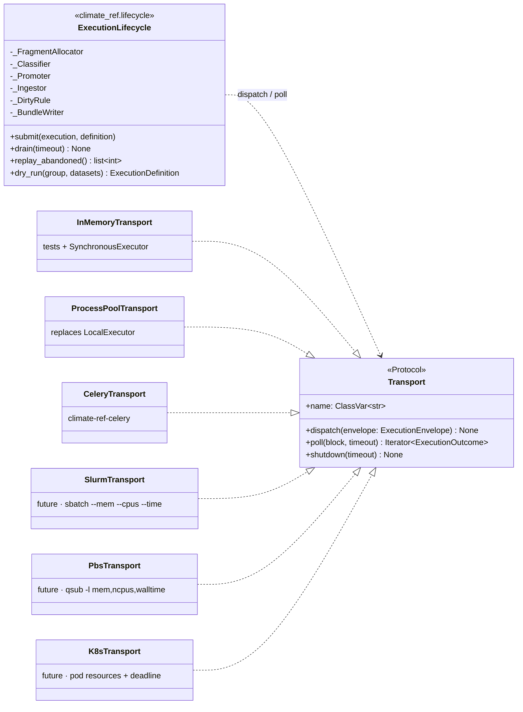
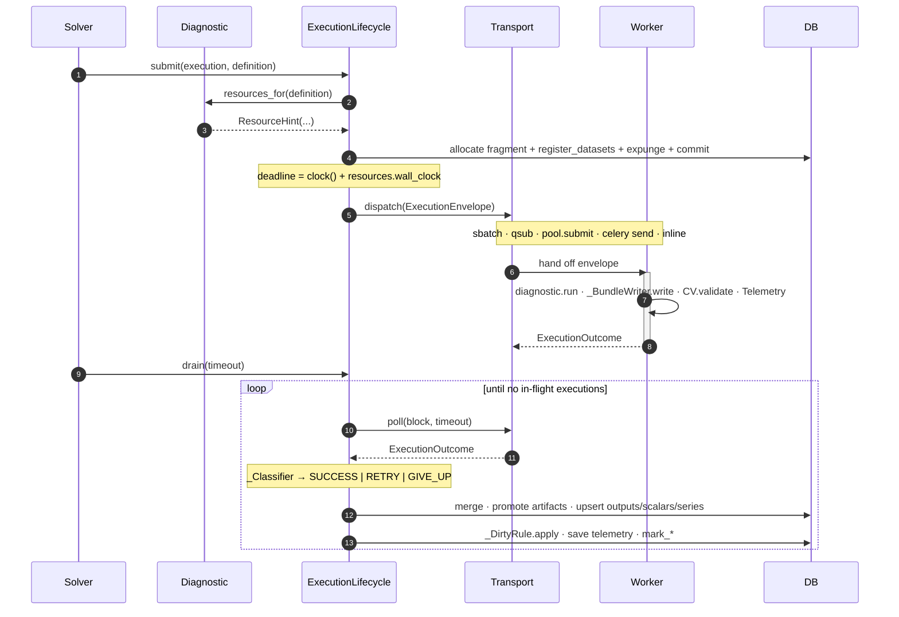

- Feature Name: `execution_lifecycle`
- Start Date: 2026-05-12
- RFC PR: [Climate-REF/rfcs#0003](https://github.com/Climate-REF/rfcs/pull/3)

# Summary
[summary]: #summary

Consolidate the lifecycle of one diagnostic execution
— allocation, dispatch, run, classify, publish, ingest, finalise —
into one deep module (`ExecutionLifecycle`) behind one `Transport` port.
Add a declarative `ResourceHint` on every `Diagnostic`
and capture per-execution `Telemetry`,
so providers can express memory / CPU / wall-clock once
and future schedulers (SLURM, PBS, K8s)
plug in as ~100 LOC adapters.

# Motivation
[motivation]: #motivation

The lifecycle of one execution is currently fragmented across ~8 files
in 2 packages.
A single happy-path run touches
`solver.py` (allocates row + fragment, register_datasets, expunge, commit),
`climate_ref_core/executor.py` (`execute_locally`, `_is_system_error`,
`CondaCommandError` handling),
`climate_ref_core/diagnostics.py` (`ExecutionResult.build_from_output_bundle`
which secretly writes three JSON files inside a frozen-attrs factory),
`climate_ref/executor/result_handling.py` (scratch→results copy ×4,
ingestion in nested-tx, dirty-flag toggled in 3 branches),
`climate_ref/executor/fragment.py` (PLACEHOLDER_FRAGMENT, group_short),
and one of `synchronous.py` / `local.py` / `climate_ref_celery/executor.py`
(each reimplementing the same reattach / commit / mark dance).

Concrete consequences today:

- **Providers have no place to declare parallelisation hints.**
  ESMValTool diagnostics that need 16 GB or 8 h have nowhere to say so;
  `LocalExecutor` hardcodes a 6 h per-task timeout,
  `CeleryExecutor` enforces no per-task timeout at all,
  and a future SLURM/PBS adapter has nothing to translate into `sbatch`/`qsub`.
- **Retry classification is scattered** across `_is_system_error`,
  the `CondaCommandError` branch, missing-log handling, `LocalExecutor`'s
  per-task timeout, and pool-shutdown abandonment.
- **The `dirty` flag is decided in three places**
  (success path, non-retryable failure, retryable failure / missing log).
- **CV validation is silenced** (`logger.warning` with TODO instead of raising).
- **Tests mock subprocess + filesystem + DB + Celery** and import private
  helpers (`_is_system_error`) to compensate for the missing seam.
- **`ExecutionResult` is not cleanly picklable** because its frozen factory
  performs disk I/O.

The CMIP REF is approaching deployment targets (SLURM / PBS / K8s) where
each new adapter would otherwise mean ~250 LOC of duplicated lifecycle
wiring.
This RFC is **not** about replacing SLURM, PBS, K8s, or Celery as schedulers.
It is about defining a single robust seam *above* them.

# Reference-level explanation
[reference-level-explanation]: #reference-level-explanation

## Module boundary



## Wire types

Picklable value objects only. No DB sessions, `Config`, or CV cross the boundary.

```python
@attrs.frozen
class ResourceHint:
    memory_mb: int = 4096
    cpu: int = 1
    wall_clock: timedelta = timedelta(hours=2)
    queue: str | None = None    # transport-specific routing tag

@attrs.frozen
class ExecutionEnvelope:
    execution_id: int
    definition: ExecutionDefinition
    resources: ResourceHint
    deadline: datetime          # clock() + resources.wall_clock at submit time

@attrs.frozen
class Telemetry:
    duration: timedelta
    peak_rss_mb: int | None
    host: str
    exit_code: int | None
    transport_meta: Mapping[str, str]   # slurm jobid / k8s pod / celery task_id

@attrs.frozen
class ExecutionOutcome:
    execution_id: int
    result: ExecutionResult | None       # None ⇒ transport-side abandonment
    failure: ExecutionFailure | None     # timeout | broker_lost | pool_shutdown
    telemetry: Telemetry
```

`ExecutionResult` becomes pure data.
The current `build_from_output_bundle` factory is split into a pure
`ExecutionResult.from_bundle(definition, bundle)` and a worker-side
`_BundleWriter.write(definition, bundle)` that owns the JSON I/O.

## Diagnostic-side declaration

```python
class Diagnostic(AbstractDiagnostic):
    resources: ResourceHint = ResourceHint()        # project-wide default

    def resources_for(self, definition: ExecutionDefinition) -> ResourceHint:
        """Optional per-execution sizing. Default returns self.resources."""
        return self.resources


# Examples
class ESMValToolDiagnostic(CommandLineDiagnostic):
    resources = ResourceHint(memory_mb=16000, cpu=4, wall_clock=timedelta(hours=6))

class EnsoDiagnostic(Diagnostic):
    resources = ResourceHint(memory_mb=24000, cpu=8,
                             wall_clock=timedelta(hours=8), queue="bigmem")

class IlambDiagnostic(Diagnostic):
    resources = ResourceHint(memory_mb=8000, cpu=2, wall_clock=timedelta(hours=2))
    def resources_for(self, defn):
        n = len(defn.datasets.get_cmip6())
        return attrs.evolve(self.resources, memory_mb=8000 + 500 * n)
```

## Solver dispatch — before and after

```python
# Before: ~50 lines of bookkeeping in solver.py:709-757
#   PLACEHOLDER_FRAGMENT, assign_execution_fragment, attrs.evolve,
#   register_datasets, expunge, commit, executor.run, … executor.join

# After:
lifecycle = ExecutionLifecycle(config, db, transport)

for group, datasets, definition in planned_executions:
    execution = Execution(execution_group=group, dataset_hash=datasets.hash,
                          provider_version=definition.diagnostic.provider.version)
    lifecycle.submit(execution, definition)

lifecycle.drain(timeout=timeout)
```

## End-to-end sequence



## Retry + dirty rule (one source of truth)

```python
class RetryDecision(enum.Enum):
    SUCCESS = "success"
    RETRY   = "retry"     # leaves dirty=True
    GIVE_UP = "give_up"   # sets dirty=False, marks failed

class DefaultRetryPolicy:
    SYSTEM_ERRORS = (OSError, MemoryError, SystemExit, KeyboardInterrupt)
    NON_RETRYABLE = (CondaCommandError,)

    def classify(self, outcome: ExecutionOutcome) -> RetryDecision:
        if outcome.failure is not None:  # timeout | broker_lost | pool_shutdown
            return RetryDecision.RETRY
        r = outcome.result
        if r is None:                    return RetryDecision.RETRY
        if r.successful:                 return RetryDecision.SUCCESS
        return RetryDecision.RETRY if r.retryable else RetryDecision.GIVE_UP
```

Replaces `_is_system_error`, the `CondaCommandError` branch,
missing-log handling, the per-task timeout path,
and pool-shutdown abandonment — five sites collapse to one.

## Idempotent ingest, telemetry

Ingestion uses `INSERT … ON CONFLICT DO NOTHING` on natural keys
(`(execution_id, output_type, short_name)` for outputs,
`(execution_id, dimensions_hash[, index_name])` for metric/series values),
so `replay_abandoned()` is safe.
Scratch-to-results copy uses `exist_ok=True`.

New `Execution` columns: `duration_seconds`, `peak_rss_mb`, `telemetry_meta JSON`.
No solver code reads these today; they exist so a future adaptive
`ResourceProvider` is a feature addition rather than a schema migration.

## Test impact

Delete: `_is_system_error` private-import tests,
subprocess patch chains in `test_providers.py`,
per-executor reattach tests,
`mark_execution_failed` mock chains.

Add boundary tests against `ExecutionLifecycle` + `InMemoryTransport`:
unique fragment per submit;
end-to-end success → `dirty=False`;
retryable failure leaves `dirty=True`;
non-retryable failure → `dirty=False`, `successful=False`;
re-drain idempotent (no double-insert);
`wall_clock` enforced uniformly across transports;
CV mismatch raises `ResultValidationError`;
`replay_abandoned` returns stranded IDs.

# Drawbacks
[drawbacks]: #drawbacks

- **Migration is wide.** The lifecycle lands in one piece because every
  transport depends on it. Transports can ship staggered after that.
- **CV becomes hard-fail.** Today's silent `logger.warning` becomes a
  raise. Intentional, but needs a one-cycle deprecation window where
  the violation is `ERROR` but not raised.
- **One fat class (~400–500 LOC).** Intentional depth, but reviewers
  should expect a large file.
- **Celery has no broker-side result handler anymore.**
  `CeleryTransport.poll` feeds outcomes back into `drain`.
  A coordinator crash mid-drain is recovered by `replay_abandoned`,
  which requires `CeleryTransport` to persist task IDs alongside
  execution IDs.
- **Resource hints can be wrong.** SLURM will OOM-kill a job whose
  declared memory is too low. Mitigated by a generous default
  (4 GB / 1 CPU / 2 h), by `ProcessPoolTransport` ignoring everything
  except `wall_clock`, and by telemetry capture making the first
  failed run actionable.

# Rationale and alternatives
[rationale-and-alternatives]: #rationale-and-alternatives

Three designs were considered.
The chosen interface is a deliberate hybrid.


| Dimension              | A — Minimal | B — Maximal | C — Common-case | **Hybrid** |
|------------------------|:-:|:-:|:-:|:-:|
| Public surface         | 1 | 5 | 2 | 2 |
| Defaults baked in      | 3 | 1 | 5 | 4 |
| Bend without editing   | 3 | 5 | 2 | 3 |
| Migration churn        | 4 | 5 | 2 | 3 |
| Resource-hint support  | 0 | 5 | 0 | 5 |
| Speculation tax        | 0 | 3 | 0 | 1 |

- **A — Minimal**: 2 methods, 1 port, everything else hidden.
  No place for resource hints or per-provider retry without later kwarg growth.
- **B — Maximal**: 5 ports (Transport, ArtifactStore, RetryPolicy,
  IngestSink, FragmentAllocator) + 7 hooks + entry-point plugin registry.
  Earned the wire-type split and `ResourceHint`; everything else is
  speculation.
- **C — Common-case**: one class, defaults sourced from `Config`,
  solver call site collapses to one line.
  A `ResultSink` callback that Celery silently ignores is an asymmetry
  that will trip someone, and there is still no place for resource hints.

**Chosen hybrid**: C's façade (one class, hot/cold method split) +
A's transport contract (`dispatch(envelope)` + `poll() -> Iterator[Outcome]`,
no result callback) + A's `BundleWriter` separation +
B's `ExecutionEnvelope`/`Telemetry` wire types.
Deferred: `ArtifactStore`, `IngestSink`, `LifecycleHooks`,
`FragmentAllocator` as a port, plugin registry.
The shallow `Executor` Protocol and the three concrete executors
are deleted.

**Impact of not doing this**: each new transport reimplements ~250 LOC
of lifecycle wiring; resource hints retrofit later through a new wire
format (strictly larger change); per-task timeout, CV validation,
dirty-flag, and retry classification stay scattered.

# Prior art
[prior-art]: #prior-art

- **Dask `distributed`** — `resources=` annotations on submitted tasks
  inspire `ResourceHint`.
- **Snakemake / Nextflow** — first-class `resources:` directives
  translate transparently into SLURM / PBS / K8s. Same mental model at
  the diagnostic level.
- **Airflow** — executor / operator split; `BaseExecutor.execute_async`
  + `sync` is essentially `Transport.dispatch` + `Transport.poll`.
- **Celery** — `task_time_limit` + queue routing. `ResourceHint.queue`
  maps onto Celery queues; `wall_clock` onto `task_time_limit` /
  `task_soft_time_limit`. Today's `CeleryExecutor` uses neither.
- **Rust RFC process** — document shape inherited via this repo's
  template.

# Unresolved questions
[unresolved-questions]: #unresolved-questions

To resolve through this RFC:

- Should `ResourceHint` include `gpu: int` / `io_intensive: bool`?
  Recommended default: add when a concrete adapter needs them.
- Where does the CV come from in tests? `PermissiveCV()` fixture
  vs. project CV baked into a constant.
- Is `replay_abandoned` automatic on `__init__` or explicit from the CLI?
  Draft assumes explicit.

To resolve through implementation:

- Exact upsert unique constraints + Alembic migration.
- `CeleryTransport.poll` semantics (per-task `AsyncResult.get` vs batch
  inspection).
- `peak_rss_mb` capture across macOS / Linux (`getrusage` unit difference).

Out of scope:

- Adaptive resource provider (telemetry columns land here; the
  provider is a follow-up RFC).
- GPU scheduling, multi-tenant queues.
- Replacing SLURM / PBS / Celery as schedulers.

# Future possibilities
[future-possibilities]: #future-possibilities

Each item below is a self-contained follow-up enabled by this RFC:

- **SLURM / PBS transports** — ~100 LOC adapters; `dispatch` builds a
  job script from `envelope.resources`, `poll` queries `squeue` / `qstat`.
- **Adaptive `ResourceProvider`** — reads `Execution.peak_rss_mb` over
  a rolling window, suggests memory hint at p95 × 1.2.
- **Per-provider retry policies** — single `RetryPolicy` becomes
  `Mapping[str, RetryPolicy]` keyed on provider slug when concrete
  demand arrives.
- **Streaming partial outcomes** — `Transport.poll` already incremental;
  add a `PartialOutcome` event when a UI consumer appears.
- **S3 / HTTP artifact store** — extract `_Promoter` into an
  `ArtifactStore` port when a non-local target lands.
- **Pluggable ingest sinks** — Prometheus, audit log, S3 mirror as
  ordered `IngestSink` observers when a second sink materialises.
- **Cross-restart recovery** — extend `replay_abandoned` with
  `Transport.lookup(transport_meta)` so a SLURM job finished while the
  coordinator was down is picked up.

None of these are reasons to accept this RFC on their own;
they show the seam is the right shape for the directions the project is
plausibly heading, without pre-baking any of them.
