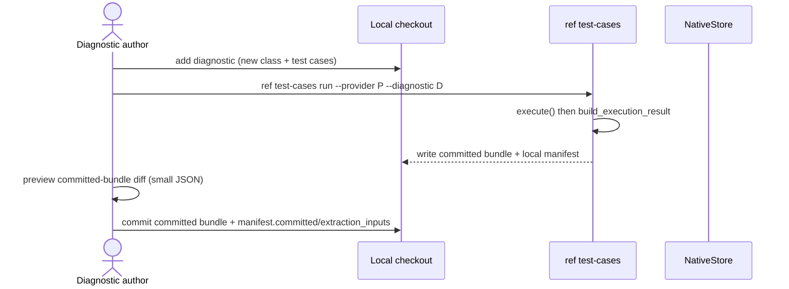
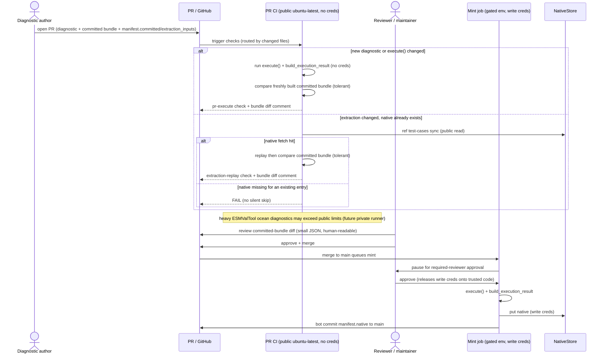
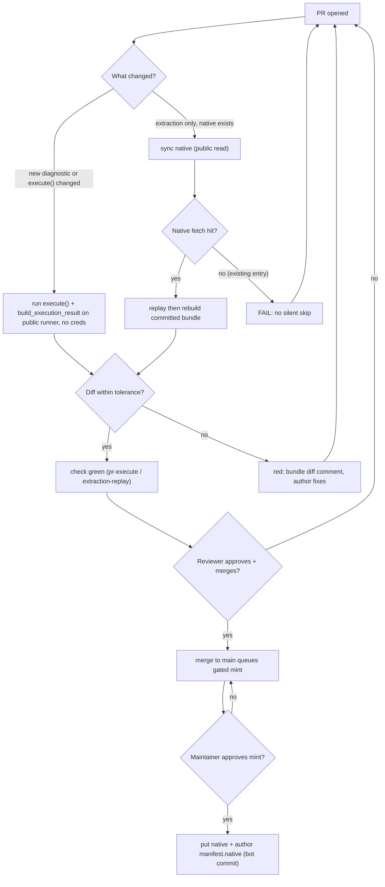

- Feature Name: `regression_baselines`
- Start Date: 2026-06-04
- RFC PR: [CMIP-REF/rfcs#5](https://github.com/CMIP-REF/rfcs/pull/0005)

# Summary

Having baseline output for a diagnostic is an important contract between the development team and the diagnostic implementor.
The baseline includes information about what the REF should extract from a diagnostic.

Each baseline (one test-case run) has **two bundles**:

1. A small, human-readable **committed bundle** (the files ingested by the REF, `series.json` + CMEC bundles)
   committed directly to the source repo.
   This should be stable and able to be reproduced by the CI.
2. A large, binary **native bundle** (the diagnostic's native outputs)
   stored outside git in an object store and referenced from a single git-committed **`manifest.json`**
   (sha256 digests of the committed bundle, the native files, and the extraction inputs).

The REF CLI (`ref test-cases`) fetches, runs, and mints baselines
with the goal of making it simple for diagnostic developers to contribute test output.

The **object-store backend is left as an explicit open decision** (see Unresolved questions) —
this RFC specifies the *layering, manifest, CLI, and CI*,
which are backend-agnostic behind a small `NativeStore` interface.

# Motivation

Diagnostic regression testing today is flaky, opaque, and bloats the repo:

- **Bloat.** `tests/.../regression` is ~1 GB on disk.
  The git repo size is growing in a way that isn't sustainable.
  We want to minimise the volume of data needed to setup the repo.
- **No clear "this-changed" signal.**
  It's hard to see the failures for diagnostics.
  There are lots of CI output making it difficult to see what has broken.
  The REF-shaped output (`series.json`, CMEC bundles) is small JSON that diffs cleanly in the PR
  and is what reviewers most need to see.
- **The extraction regression never runs on a PR.**
  It runs only post-merge/nightly today,
  so a PR that breaks extraction goes green, then red after merge.
  The integration tests are currently broken and require a refresh of the regression data.
- **Most diagnostic authors are external scientists.**
  Require minimal setup, no new credentials.
  A contributor should need only the REF and shouldn't need to touch more than a few files to add a diagnostic.
- **Security.**
  The integration runner shares a writable cache so we must be careful that fork code must never reach it or any write credentials.

# Reference-level explanation

## Two bundles, one manifest

For each `(provider, diagnostic, test-case)`:

```text
packages/<provider>/tests/test-data/<diagnostic>/<test-case>/
  catalog.yaml            # committed: dataset metadata (exists today, content-hashed)
  catalog.paths.yaml      # gitignored: per-user local paths (exists today)
  regression/
    series.json           # committed bundle (the gate + diff signal)
    diagnostic.json        # committed bundle (CMEC metric bundle)
    output.json           # committed bundle (CMEC output bundle)
  manifest.json           # committed: source of truth binding committed bundle <-> native bundle
```

The native bytes (provenance + matched `*.nc` / `*.png`) live in the object store, **not** in git.

`manifest.json`:

```json
{ "schema": 1,
  "committed":  { "series.json": "<sha256>", "diagnostic.json": "<sha256>", "output.json": "<sha256>" },
  "native":  { "<relpath>": { "sha256": "...", "size": ... } },
  "extraction_inputs": { "files_series_digest": "<sha256>", "input_selectors_digest": "<sha256>" } }
```

- `committed` binds the committed bundle bytes to the manifest **for integrity only**:
  CI recomputes the committed digests and asserts they equal `manifest.committed`.
  A commit that updates `series.json` but not the manifest (or vice-versa) **fails loudly**.
- `native` lists the curated native blobs by content digest.
  These digests are **authored only by the `mint` action**: the value is the sha256 of the exact bytes `mint` uploaded to the store.
- `extraction_inputs` hashes the diagnostic's `files`/`series` patterns and the catalog `input_selectors` —
  the real extraction inputs the current catalog hash ignores —
  so a change to extraction behaviour bumps the manifest *at PR time*.

**Digests do not gate reproducibility.**
Native bytes are nondeterministic (`.nc`/`.png` embed timestamps, library versions, and provenance, floats jitter across platforms),
so re-running `execute()` on a different machine yields different bytes resulting in a different digest for an unchanged diagnostic.
The CI therefore never recomputes a native digest and compares it to the manifest.
A mismatch is expected, and not a failure.

The gate for being able to reproduce values deterministically is the **committed bundle**,
compared by content with tolerance (see Comparison).
The `native` block **churns on every real mint** (timestamps and maybe SHAs shift),
so it is not a clean "native meaningfully changed" signal.
Only the `committed` block is a semantic diff signal
Remint when the committed bundle changes or a new test-case lands, not on native drift.

Some of the native content may be useful to compare visually for example figures.
How that is surface is not yet resolved.

The consistency enforced:

| pair                                                  | enforced              | how                                             |
| ----------------------------------------------------- | --------------------- | ----------------------------------------------- |
| in-repo committed bundle <> `manifest.committed`      | yes — integrity gate  | CI recompute equals (tamper/desync check)       |
| replayed committed bundle <> in-repo committed bundle | yes — regression gate | content compare with tolerance (see Comparison) |
| stored native bytes <> `manifest.native` digest       | by construction       | `mint` hashes what it uploads                   |
| re-executed native <> `manifest.native` digest        | **no — by design**    | nondeterministic; gate is the committed bundle  |

## Curated capture

There will be additional files in the native bundle that aren't needed,
including the climate data that ESMValTool includes in the output directory.

The diagnostic already declares which native files matter via `files` + `series` glob patterns
with production publishing copies only those (the CMEC `output.json` subset).
The regression capture must use the **same curation** instead of copying the whole working directory.
Diagnostic authors control what is stored/pruned through those existing patterns,
and any errors in this process will be surfaced as differences in the committed bundle.

## `NativeStore` interface

The REF talks to the store through a thin Protocol
so the backend is swappable and unit-testable,
and so this RFC does not have to settle the backend to be implementable:

```python
class NativeStore(Protocol):
    def has(self, digest: str) -> bool: ...
    def fetch(self, digest: str, dest: Path) -> None: ...   # by sha256; public read, no creds
    def put(self, path: Path) -> str: ...                    # returns sha256; needs write creds
```

Required properties of whatever backend is chosen:

- **Anonymous public read** so fork CI and contributors fetch without credentials.
- **Writes gated to trusted contexts only** (CI on `main`, or maintainers).
- Retention that **never expires a digest still referenced by a reachable manifest**.
- Potentially using content-addressed (sha256) storage, but this complicates the expiration.

The backend will be prototyped using an R2 bucket on Cloudflare,
with the CI having write credentials to mint new baselines.

## CLI (extends the existing `ref test-cases` cli)

| Subcommand                           | Purpose                                                                               | Creds              |
| ------------------------------------ | ------------------------------------------------------------------------------------- | ------------------ |
| `run --provider P --diagnostic D`    | run `execute()` + `build_execution_result`, write committed bundle + a *local* manifest | none (local)       |
| `sync [--provider P]`                | fetch native blobs named by the committed manifest(s)                                 | none (public read) |
| `replay --provider P --diagnostic D` | fetch native, run `build_execution_result`, compare to committed bundle               | none (public read) |
| `mint --provider P`                  | `run` + `put` native to the store + author the canonical `manifest.native`            | write creds        |

`mint` is the only credentialed verb, and the only writer of canonical native digests,
so anonymous users can fetch the native baseline.
A dev `run` produces native and a local manifest for previewing the committed-bundle diff
with the native digests being advisory and never committed.
A PR commits only the committed bundle + `manifest.{committed,extraction_inputs}` —
the `native` block is authored exclusively by the post-merge `mint` action so native digests exist iff `mint` wrote them.

## Tiered CI

The PR tier runs **credential-free** so it can safely execute fork code.
Self-hosted runners should never run `execute()` holding write creds on a shared writable cache.

Minting stays post-merge behind a manual gate as it requires credentials.

- **PR — any, incl forks — public `ubuntu-latest`, no secrets, no creds.**
  Routed by changed-files so the check is *honest*:
  - **New diagnostic / new test-case, or `execute()` changed** -> run `execute()` + `build_execution_result` on the public runner,
    then compare the freshly built committed bundle against what is in git.
    At this point, any existing native content may be invalidated.
  - **Extraction changed (`build_execution_result`, `files`/`series`, committed/manifest) and native already exists** ->
    cheap path: `ref test-cases sync` (read native content) -> `replay` -> compare committed bundle.
  - A fetch *miss* for an **existing** manifest entry is a **failure, not a skip**
    (today, missing fixtures silently skip -> false green);
    a *new* entry has no stored native by definition and takes the execute path instead.
  - **Coverage:** the public runner handles ~90% of test-cases.
    Some heavy ESMValTool ocean diagnostics exceed its compute/memory/disk and will fail there —
    those wait for the future private runner (see below); they are not a silent skip.
- **Merge to `main`**
  A job bound to a GitHub **Environment (`mint`)**:
  the run pauses until a maintainer approves, releasing the write creds only onto **already-merged (trusted) code**.
  On approve: `ref test-cases mint` -> `execute()` + `put` native + author `manifest.native` (bot commit back to `main`).
  **Mint set** = test-cases whose committed bundle or `extraction_inputs` changed in the merge diff;
  a manual `workflow_dispatch` can target a specific `--provider`/`--diagnostic` for backfills or manual fixes.
- **Nightly — gated runner.**
  Full sweep to check for any drift.
  This will `execute()`, `build_execution_result` and compare.
  This job should output a human-readable summary as part of the workflow.
- **Future — private read-only runner.**
  For the heavy diagnostics the public runner cannot host.
  Safe to run fork code only if each job is **ephemeral / container-per-job**, mounts conda + data **read-only**,
  carries **no write creds**, and has **controlled egress** (no shared writable cache).
  Deferred: start public-only.

## PR workflow

Two phases: the diagnostic **author** first builds and runs the test-case **locally**,
then opens a PR that the **reviewer** drives through CI to merge.

### 1. Author a new diagnostic (local, no creds)



A local `run` produces native + advisory digests for preview only — the author commits no `native` block.
Canonical `manifest.native` is authored later by the gated post-merge `mint`.

### 2. Make a PR (review + CI)



### 3. CI routing (decision view)

How the PR check is chosen from the changed files, and where each path lands:



## Comparison

The regression gate compares a freshly replayed committed bundle to the in-repo reference **by content, not by bytes**.
Byte/digest equality is too strict as the artifacts may include floats which will lead to flaky test results.

- **Fast path:** if bytes are already equal, pass without the content compare; only mismatches fall through to the tolerant path.
- Tolerances are **declared per diagnostic/test-case** — a global default with per-case overrides.

We are comparing the content of the files which are ingested by the REF.
Changes to other native files aren't covered by this approach other than the existance of them.
This could be extended to cover these files, but we don't control their shape.

## Determinism

Content comparison still requires removing avoidable nondeterminism at capture time:

- **Execution-dir timestamp.**
  ESMValTool writes a `recipe_<YYYYMMDD>_<HHMMSS>` dir that gets baked into `output.json`.
  Sanitise `recipe_\d{8}_\d{6}` -> a placeholder in both capture and comparison.
  Tracked as [Climate-REF/climate-ref#713](https://github.com/Climate-REF/climate-ref/issues/713).
- **Floats.**
  Any float values should be compared using a relative tolerance to the baseline.
  Resolving these kinds of CI-dev machine differences is time consuming.
- **Binary files.**
  We don't compare SHAs of generated files as they will differ depending on who generated the files (especially with NetCDF files).
  We shouldn't try and chase perfect hash consistency.
  The SHA in the manifest is for validating a fetched blob against its store address, not for gating reproducibility.

# Drawbacks

- The REF CLI owns fetch/mint/credential plumbing —
  more surface to maintain and test, but that is easier than a sprawl of user tests.
- Native is a cache of a regenerable artifact:
  losing a digest still referenced by a reachable manifest breaks historical replay.
  They can always be replaced.
- The public PR runner covers ~90% of test-cases but not all:
  heavy ESMValTool ocean diagnostics exceed its compute/memory/disk
  and have no automated PR signal until the future private runner lands.
- Historical bloat remains: existing committed binaries are not rewritten out of history
  (the repo is already used by externals so rewriting history is hard).

# Rationale and alternatives

**Why two bundles.**
Keeping the small REF-shaped committed bundle in git
puts the review signal where reviewers already work (the PR diff)
and keeps the gate human-readable;
moving the large binaries out of git removes the bloat
while still making them fetchable for the extraction test.
The split maps cleanly onto what the REF already does for catalogs
(`catalog.yaml` committed, `catalog.paths.yaml` gitignored).

**Why a manifest + CLI rather than committing the bytes.**
Measured native is too large to commit (pmp 250 MB, ilamb 61 MB).
A content-addressed manifest gives dedup, per-commit pinning of the exact native bytes,
and a fetchable fixture without binaries in git.
The clean in-PR semantic diff comes from the committed bundle, not the native digests
(which churn on every mint — see the manifest section).

**Alternatives considered:**

- **Commit curated native to git.**
  Curating causes the inability to regenerate the output.json file.
- **Git LFS.**
  Pointer churn remains; GitHub LFS egress costs are very low and it requires additional steps when checking out.
- **Regenerate-on-demand, store nothing.**
  The cheap `extraction-replay` path skips conda + `execute()` by fetching stored native;
  dropping the store forces every PR onto the slow execute path.
  Storing native keeps the common extraction-only PR fast.
  Per-provider the `NativeStore` interface still allows mixing
  (a provider with a low fetch rate could regenerate instead of store).

  Generally it would take significant CI time to regenerate on every commit.

**Impact of not doing this.**
Contributors keep hand-rolling baselines,
PRs keep shipping output changes without a visible diff,
and silent upstream regressions stay invisible until a manual check.

# Prior art

- The REF's existing **catalog split** —
  the exact "commit small metadata, keep bytes out of git" pattern, here extended to outputs.
- **pytest-regressions** (`--force-regen`) — the regenerate-the-committed-bundle workflow this mirrors.
- `ref-sample-data` used CI owned data,
- Content-addressed artifact stores with a small in-git lock (DVC, Snakemake) — same idea;
  this RFC keeps the client surface to just the REF CLI
  rather than adding a separate toolchain on contributors.

# Unresolved questions

- **Object-store backend choice** — the main open decision.
  The most obvious choice is another R2 bucket similar to the datasets.
  **No backend is assumed by this RFC.**
- Retention policy for non-current native versions.
- Whether the PR comment should render a **figure diff** (PNG) / **NetCDF stat diff**,
  or defer to a follow-up.
- **Private read-only runner** for the heavy diagnostics the public runner cannot host —
  isolation model (ephemeral container, read-only mounts, no creds, controlled egress) and when to build it.
- Scope of the manual `mint` **`workflow_dispatch`** (targeting, backfills, store-loss recovery)
  beyond the automatic merge-diff mint set.

# Future possibilities

- Rich diff renderers in the PR comment (PNG diffs, NetCDF summary-stat diffs).
- Reuse the same `NativeStore` + manifest for large reference/observational inputs too big for git.
- A `ref test-cases preview` that serves locally what the API would render for a PR,
  straight from a synced native fixture (already the `replay` path).
- Signed manifests for end-to-end baseline provenance.
